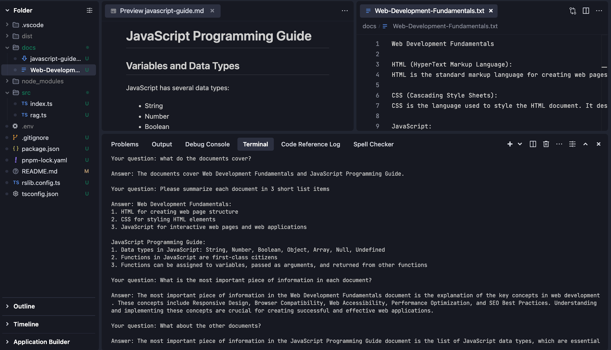

# RAG project

This is a Retrieval-Augmented Generation (RAG) application that allows you to ask questions about your documents.

The application processes markdown and text files from a specified directory and uses AI to provide relevant answers based on the content of these documents.

This application uses OpenAI's GPT-3.5-turbo model for generating responses.

This application was built entirely by Trae, using Claude-3.5-Sonnet as the LLM.

## Features

- Processes `.txt` and `.md` files
- Uses OpenAI's language models for understanding and answering questions
- Maintains conversation history for context
- Provides accurate responses based on your document content

## Usage

1. Place your documents in the `docs` directory
2. Set up your OpenAI API key in `.env`
3. Run the application:

```bash
npm run dev
```

## Demo



### Developing with RsLib

link to the library: <https://lib.rsbuild.dev/>

## Setup

Install the dependencies:

```bash
pnpm install
```

## Get started

Build the library:

```bash
pnpm build
```

Build the library in watch mode:

```bash
pnpm dev
```
